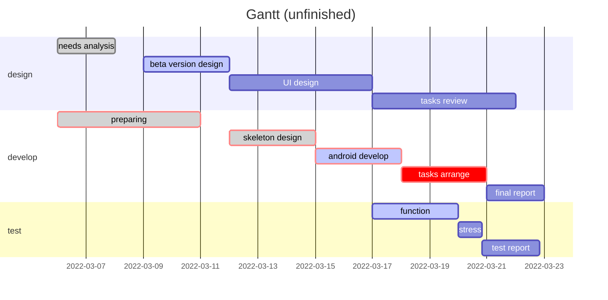

## Document Description

---

The document consists of two parts:

1.  The first is an overview of the project.
2.  The second part is the decision process in chronological order. And below each decision, there are some links to the document about the process that how to make it.

## Project Overview

---

### Project Introduction：

- Develop a personalized, user-friendly health APP using Android

### Project Landing Page: [Link to Landing Page](https://personalisednutrition.github.io/)

### Project design:

> source: [Statement Of Work v1.3](https://anu365-my.sharepoint.com/:w:/g/personal/u7175274_anu_edu_au/Efm1kUvjZ2BLjSEMPjtS4Y8BiMSoTsCM4RXhh1Vd0LV8-g?e=CPvAb9)

| Task | **Work**  MILESTONES                                         | Completion date |
| :--: | :----------------------------------------------------------- | :-------------: |
|  1   | Complete user system functions.                              |     Week 5      |
|  2   | Complete basic data input system.                            |     Week 7      |
|  3   | Complete algorithm development for report generation module and image recognition algorithm. |     Week 8      |
|  4   | Complete the build of the nutritionist side of the function. Export data available. |     Week 10     |
|  5   | Complete the building of the communication interface.        |     Week 11     |
|  6   | Complete the app testing.                                    |     Week 12     |

### Members:

| Name        | title           | Email               |
| ----------- | --------------- | ------------------- |
| Bowen Zhang | Scrum Master    | u7274475@anu.edu.au |
| Yuhao Zhai  | Spokesperson    | u7152566@anu.edu.au |
| Shuyi Chen  | Spokesperson    | u7175274@anu.edu.au |
| Tianqi Tang | Techinical Lead | u7192230@anu.edu.au |
| Shiyun Zhu  | ALGO Manager    | u7041419@anu.edu.au |
| Xinyue Hu   | UI Manager      | u7151386@anu.edu.au |

### Communication Plan:

| Stakeholder | **Method**   | **Frequency**                                     |
| :---------: | ------------ | ------------------------------------------------- |
|   Client    | Email & Zoom | Tuesdays every two weeks 13:30-14:30 &as required |
|    Tutor    | Email & Zoom | Weekly tutorial Thursday 13-15 PM & as required   |
| Shadow Team | Wechat       | Weekly Tutorial & as required                     |
|    Team     | Wechat       | Weekly on Sunday 19-21 pm & as required           |

## Decision Record

---

##### Time: 2022.3.15

> **Decision members:** All members
>
> **Decision topic:** Make use of the feedback of ‘Many Eyes’ evaluations.
>
> **Decision material:** 
>
> 1. Project schedule.
> 2. The feedback of ‘Many Eyes’ evaluations(self, shadows, tutor).
>
> **Decision results:**
>
> 1. In order to explore the value of suggestions and use them to improve the project plan, we decide to analyze the feedback. Each member handles a part of it, and one person to summarize(Details below).
>    1. Yuhao Zhai - Project Output
>    2. Xinyue Hu - Decision Making
>    3. Tianqi Tang - Team Work
>    4. Shuyi Chen - Communication
>    5. Bowen Zhang - Reflection
>    6. Shiyun Zhu - Summarize
> 2. According to the advice, build a *Project log file* to record decisions witch are approved and will be implemented, helping us manage projects better and improve ourselves.
>
> **Decision process and decision analysis:** [link to the document]()

